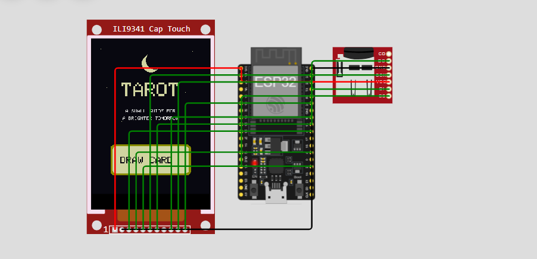

# pocket-tarot-card-reader
🔮 Interactive ESP32-powered Tarot reader featuring a full 78-card deck, random upright/reversed draws, card meanings, custom pixel-art artwork, microSD storage, and touchscreen navigation. Built with C++/Arduino, ESP32, ILI9341 and XPT2046.

pocket-tarot-card-reader/
│
├── README.md
├── sketch.ino
├── tarot_data.h
├── tarot-reader-wokwi.png
└── wokwi/
    ├── diagram.json
    └── libraries.txt
